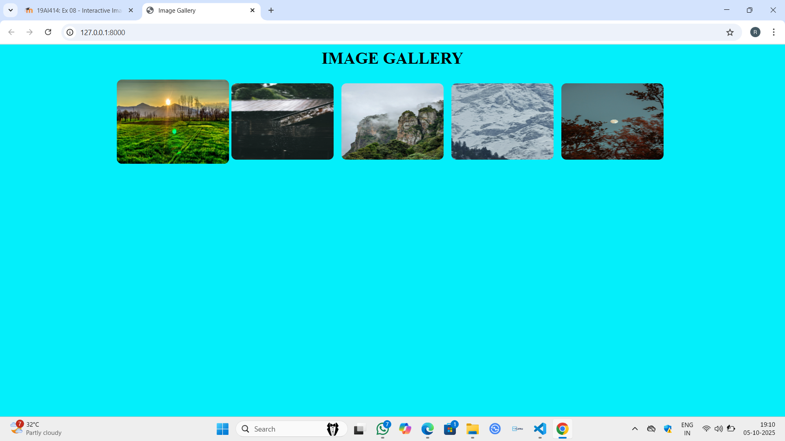
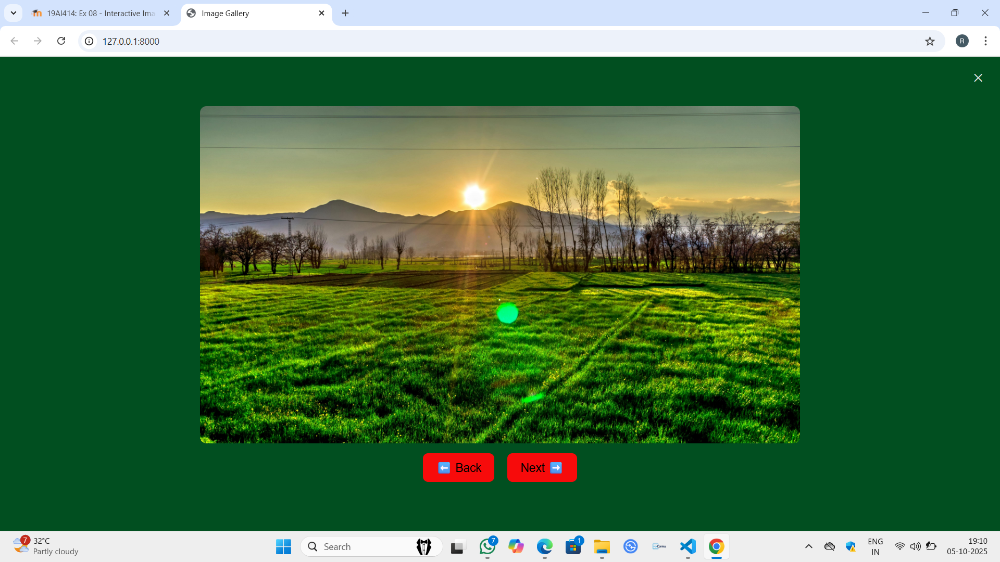

# Ex.08 Design of Interactive Image Gallery
# Date:05.10.2025
# AIM:
To design a web application for an inteactive image gallery with minimum five images.

# DESIGN STEPS:
## Step 1:
Clone the github repository and create Django admin interface.

## Step 2:
Change settings.py file to allow request from all hosts.

## Step 3:
Use CSS for positioning and styling.

## Step 4:
Write JavaScript program for implementing interactivity.

## Step 5:
Validate the HTML and CSS code.

## Step 6:
Publish the website in the given URL.

# PROGRAM :
```
<html lang="en">
<head>
    <meta charset="UTF-8">
    <title>Image Gallery</title>
    <style>
        body {
            background: #03effb;
            font-family:italic;
            text-align: center;
        }
        .gallery {
            display: flex;
            flex-wrap: wrap;
            justify-content: center;
            gap: 15px;
            margin-top: 30px;
        }
        .gallery img {
            width: 200px;
            height: 150px;
            border-radius: 10px;
            cursor: pointer;
            transition: transform 0.3s;
        }
        .gallery img:hover {
            transform: scale(1.1);
        }

        
        #popup {
            display: none;
            position: fixed;
            top: 0; left: 0;
            width: 100%; height: 100%;
            background: rgb(1, 79, 32);
            justify-content: center;
            align-items: center;
            flex-direction: column;
        }
        #popup img {
            width: 60%;
            max-height: 80%;
            border-radius: 10px;
        }

        
        .nav-buttons {
            display: flex;
            justify-content: center;
            gap: 20px;
            margin-top: 15px;
        }
        .btn {
            background-color: #f70b0b;
            border: none;
            border-radius: 8px;
            padding: 10px 20px;
            font-size: 18px;
            cursor: pointer;
            transition: 0.3s;
        }
        .btn:hover {
            background-color: #ddd;
        }
        .close-btn {
            position: absolute;
            top: 15px;
            right: 25px;
            font-size: 30px;
            color: rgb(239, 229, 229);
            cursor: pointer;
        }
    </style>
</head>
<body>
    <h1>IMAGE GALLERY</h1>
    <div class="gallery">
        
        
        
        
        
    </div>

    <div id="popup">
        <span class="close-btn">&times;</span>
        
        <div class="nav-buttons">
            <button id="prev" class="btn">⬅️ Back</button>
            <button id="next" class="btn">Next ➡️</button>
        </div>
    </div>

    <script>
        const popup = document.getElementById('popup');
        const popupImg = document.getElementById('popup-img');
        const closeBtn = document.querySelector('.close-btn');
        const nextBtn = document.getElementById('next');
        const prevBtn = document.getElementById('prev');
        const images = document.querySelectorAll('.gallery img');
        let currentIndex = 0;

        
        images.forEach((img, index) => {
            img.addEventListener('click', () => {
                popup.style.display = 'flex';
                popupImg.src = img.src;
                currentIndex = index;
            });
        });

        
        closeBtn.addEventListener('click', () => {
            popup.style.display = 'none';
        });

        
        nextBtn.addEventListener('click', (event) => {
            event.stopPropagation();
            currentIndex = (currentIndex + 1) % images.length;
            popupImg.src = images[currentIndex].src;
        });

        
        prevBtn.addEventListener('click', (event) => {
            event.stopPropagation();
            currentIndex = (currentIndex - 1 + images.length) % images.length;
            popupImg.src = images[currentIndex].src;
        });

        
        popup.addEventListener('click', (event) => {
             if(event.target === popup) {
                popup.style.display = 'none';
            }
        });
    </script>
</body>
</html>

urls.py
from django.contrib import admin
from django.urls import path
from rog import views

urlpatterns = [
    path('admin/', admin.site.urls),
    path('',views.index,name='index'),
]

views.py
from django.shortcuts import render
def index(request):
    return render(request,'index.html')
```
# OUTPUT:



# RESULT:
The program for designing an interactive image gallery using HTML, CSS and JavaScript is executed successfully.
